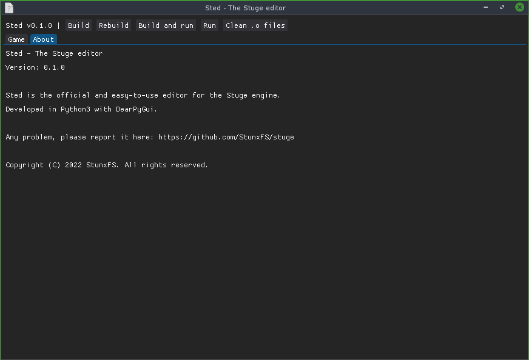

# Sted - The Stuge editor

<div align="center">



</div>

Sted is the official and easy-to-use editor for the Stuge engine.
Developed in Python3 with [DearPyGui](https://github.com/hoffstadt/DearPyGui).

## Running

```bash
python3 sted/main.py
```
